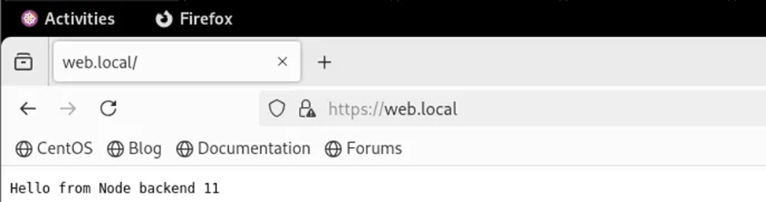
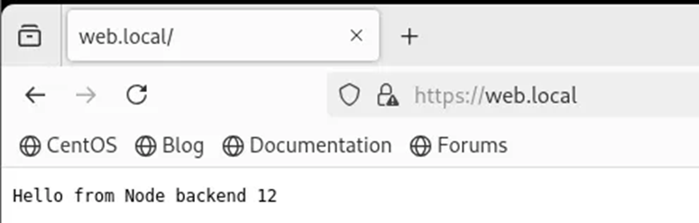

# NGINX làm Reverse Proxy và Loadbalance
## NGINX làm LB
1. Mô hình   
   
3.  Cấu hình server Nginx:    
    Cài đặt Nginx trên 192.168.1.11:  
    ```bash
    sudo apt install nginx -y 
    ```
    Cấu hình HTTPS cho Nginx:  
    a. Tạo thư mục để lưu private key và certificate cho domain là web.local   
    ```
    sudo mkdir -p /etc/nginx/ssl/site  
    cd /etc/nginx/ssl/site   
    ```
    b. Sinh khóa  
    ```
    sudo openssl req -x509 -nodes -days 365 \
    -newkey rsa:2048 \
    -keyout site.key \
     -out site.crt \ 
     -subj "/C=VN/ST=Hanoi/L=Hanoi/O=LocalOrg/OU=IT/CN=web.local" 
     ```
     Ta sẽ có 2 file key và cert như sau:   
     ```
     khabt@ubuntulpi01:/etc/nginx/ssl/site$ ls 
    site.crt  site.key
    ```
    c. Tạo một file nginx-lb.conf trong đường dẫn /etc/nginx/conf.d/ :
    ```
    sudo vim /etc/nginx/conf.d/nginx-lb.conf
    ```
    Thêm cấu hình sau:
    ```bash
      upstream backend {
         server 192.168.1.11:3000;
         server 192.168.1.10:3001;
      }

      server {
         listen 443 ssl;
         server_name web.local;

         ssl_certificate     /etc/nginx/ssl/site/site.crt;
         ssl_certificate_key /etc/nginx/ssl/site/site.key;
         ssl_protocols TLSv1.2 TLSv1.3;

      location / {
        proxy_pass http://backend;
        proxy_set_header Host $host;
        proxy_set_header X-Real-IP $remote_addr;
    }
      }

      Redirect HTTP → HTTPS (optional)
      server {
         listen 80;
         server_name web.local;
         return 301 https://$host$request_uri;
      }
      ```
   
      Chạy lệnh check syntax:   
      ```
      sudo nginx -t
      ```   
      Khởi động lại Nginx:    
      ```
      sudo nginx -s reload
      ```
4. Trên máy có ip 192.168.1.11 & 192.168.1.10   
   Tạo 2 đoạn code đơn giản chạy code Nodejs   
   Cài nodejs trên 2 server này:   
   ```
   sudo apt install nodejs -y
   ```
   Viết 1 đoạn code app.js đơn giản trên 2 server :  
   Trên server 192.168.1.11:
   ```
   //app.js
   const http = require('http');
   const server = http.createServer((req, res) => {
   res.end('Hello from Node backend 11');
   });
   server.listen(3000);
   ```
   Trên server 192.168.1.10:
   ```
   // app.js
   const http = require('http');
   const server = http.createServer((req, res) => {
   res.end('Hello from Node backend 12');
   });
   server.listen(3001);
   ```
   Sau đó trên 2 máy chạy code :   
   ```
   node app.js
   ```
   Mở port:
   - Mở port 3000 trên server 192.168.1.11:   
      ```
      sudo ufw allow from 192.168.1.11 to any port 3000 proto tcp
      ```
   - Mở port 3001 trên server 192.168.1.10:
      ```
      sudo ufw allow from 192.168.1.12 to any port 3001 proto tcp
      ```
Trên Browser khi truy cập web.local nginx sẽ trả về phản hồi từ 2 server backend lần lượt theo thuật toán round robin:




